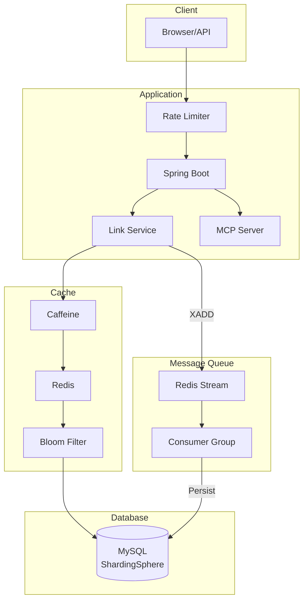
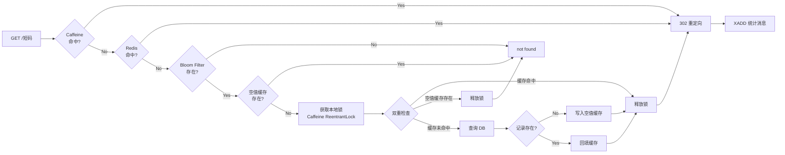
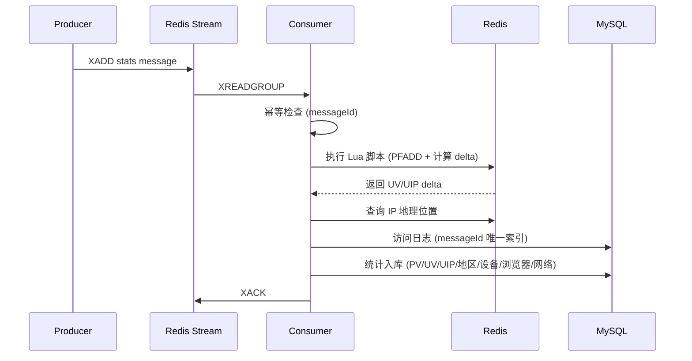
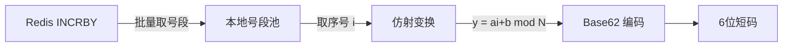

# ShortLink

高性能短链接服务，基于 Spring Boot 3 + Redis + ShardingSphere 构建。

**前端仓库**：https://github.com/ChanlerDev/v0-shortlink

## Features

- **短链接生成** - Redis 号段 + 仿射 Base62，6 位短码
- **302 跳转** - 多级缓存（Caffeine → Redis → Bloom Filter），毫秒级响应
- **访问统计** - Redis Stream 异步消费，多维度统计（PV/UV/地区/设备/浏览器）
- **限流保护** - Guava RateLimiter + Redis Lua 滑动窗口
- **分库分表** - ShardingSphere 16 表水平分片
- **MCP 集成** - 标准 SSE 端点，支持 AI 工具调用

## 压测结果

### 创建短链接（600 并发）

<table>
  <tr>
    <td style="text-align:center;">JMeter Summary Report</td>
    <td style="text-align:center;">JMeter TPS Chart</td>
  </tr>
  <tr>
    <td>
      
    </td>
    <td>
      
    </td>
  </tr>
  <tr>
    <td style="text-align:center;">Response Times (ms)</td>
    <td style="text-align:center;">Docker Activity Monitor</td>
  </tr>
  <tr>
    <td>
      
    </td>
    <td>
      
    </td>
  </tr>
</table>

### 跳转短链接（1000 并发）

<table>
  <tr>
    <td style="text-align:center;">JMeter TPS Chart</td>
    <td style="text-align:center;">Response Times (ms)</td>
  </tr>
  <tr>
    <td>
      
    </td>
    <td>
      
    </td>
  </tr>
  <tr>
    <td style="text-align:center;">JMeter Summary Report</td>
    <td style="text-align:center;">Docker Activity Monitor</td>
  </tr>
  <tr>
    <td>
      
    </td>
    <td>
      
    </td>
  </tr>
</table>

### 统计消费（4 个 Consumer）

<p style="text-align:center;">
  
</p>

## Architecture



## Redirect Flow



## Stats Consumer Flow



## 核心设计

### 短码生成：号段 + 仿射置换

**问题**：如何高效生成全局唯一、不可预测的短码？

**方案**：



1. **号段模式**：通过 `INCRBY` 一次获取 10000 个序号，减少 Redis 网络往返
2. **异步预取**：号段剩余 20% 时触发异步预取，避免耗尽时阻塞
3. **仿射置换**：`y = (a*i + b) mod 62^6` 打散连续序号，短码不可预测
4. **反向解码**：支持从短码反算序号，快速判断是否可能存在（前置过滤）

### 多级缓存：降低尾延迟

**问题**：高并发跳转场景下，如何保证毫秒级响应？

**方案**：四级缓存逐层降级

| 层级 | 组件 | 作用 | TTL |
|------|------|------|-----|
| L1 | Caffeine | 热点本地缓存，避免网络开销 | 10min |
| L2 | Redis | 分布式缓存，多实例共享 | 跟随有效期 |
| L3 | Bloom Filter | 快速否定不存在的短码 | 持久化 |
| L4 | 空值缓存 | 防止穿透，缓存不存在的 key | 30min |

**本地互斥锁**：缓存未命中时使用 `Caffeine + ReentrantLock` 做本地锁，避免分布式锁的尾延迟放大问题。

### 异步统计：解耦跳转与持久化

**问题**：统计入库不应阻塞跳转响应，如何保证可靠性？

**方案**：Redis Stream + Consumer Group

1. **生产**：跳转时 `XADD` 写入统计消息，立即返回 302
2. **消费**：Consumer Group 消费，支持多实例水平扩展
3. **幂等**：
   - Redis 标记：MessageQueueIdempotentHandler 防止重复处理
   - DB 兜底：messageId 唯一索引，DuplicateKeyException 直接视为成功
4. **恢复**：定时任务扫描 Pending 消息，自动重试超时未 ACK 的消息
5. **UV/UIP**：HyperLogLog + Lua 脚本 `hll_count_add_delta.lua` 原子计算增量
6. **多维统计**：地区、操作系统、浏览器、设备、网络、访问日志

### 分库分表：水平扩展

ShardingSphere 按 `gid` 哈希分 16 张表，避免单表数据量过大：

```
t_link_0, t_link_1, ... t_link_15
t_group_0, t_group_1, ... t_group_15
```

---

## Quick Start

参考 [DEPLOYMENT.md](DEPLOYMENT.md)

## Project Structure

```
src/main/java/dev/chanler/shortlink/
├── common/           # 配置、过滤器、异常处理
├── controller/       # 接口
├── service/          # 业务逻辑
├── dao/              # 数据访问层
├── mq/               # Redis Stream 生产者/消费者
├── mcp/              # MCP AI 工具集成
└── toolkit/          # 工具类（短码生成、IP 地理位置）
```
